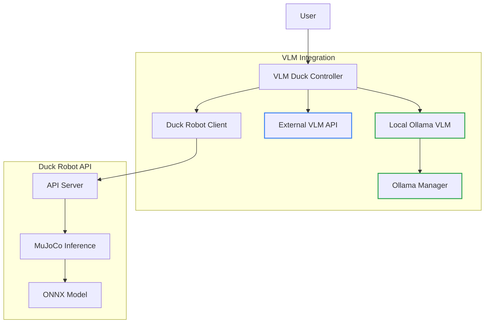
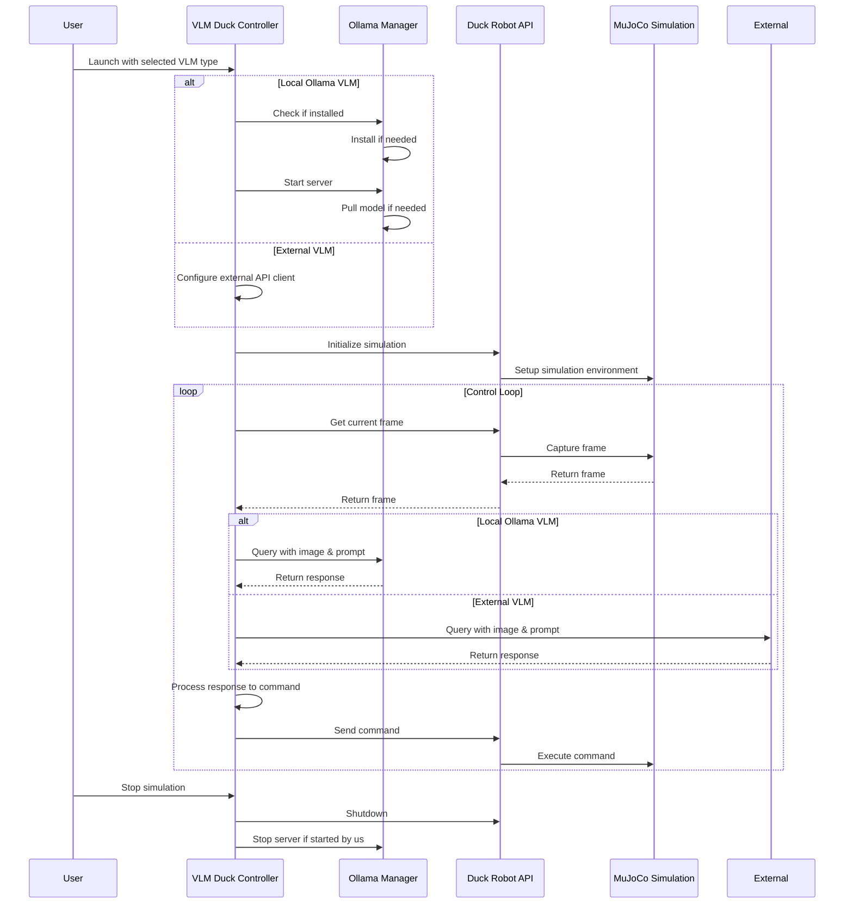
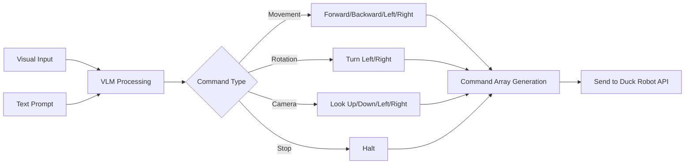

# Open Duck VLM Integration

This project integrates Vision Language Models (VLMs) with the Open Duck Robot, enabling natural language control of the duck robot in the MuJoCo simulation environment.

## Project Overview

The integration allows users to:
1. Control the duck robot using natural language commands
2. Use vision-language models to interpret the robot's surroundings
3. Send appropriate commands based on visual input and language processing

## Architecture



## Control Flow



## Natural Language Command Processing



## Installation

### Prerequisites

- Python 3.8 or higher
- MuJoCo environment
- ONNX model for Duck Robot control

### Setup

1. Clone the repository:
   ```bash
   git clone https://github.com/yourusername/open_duck_vlm.git
   cd open_duck_vlm
   ```

2. Install dependencies using UV:
   ```bash
   uv venv
   uv pip install -e .
   ```

3. Set up a VLM:
   - Option 1: **Local Ollama VLM** (recommended for robot deployment)
     ```bash
     # Install and set up Ollama automatically
     uv run ollama-manager install
     
     # Or manually from https://ollama.com
     ```
     
   - Option 2: External VLM API (cloud-based solution)
     - Obtain API access to a vision-language model service

## Usage

### Running with Ollama (Local VLM)

```bash
# Start with default settings
uv run ollama-run

# With specific model
uv run ollama-run --ollama-model=llava-next

# Check available Ollama models
uv run ollama-manager list

# Pull a specific model
uv run ollama-manager pull llava
```

### Running with External VLM API

```bash
uv run external-run --vlm-api=https://your-vlm-api.com/vision --vlm-key=your-api-key
```

### Interactive Mode

Run in interactive mode to send direct commands:

```bash
uv run interactive
```

## VLM Options

### Local Ollama VLM

The Ollama Manager utility (`ollama.py`) provides a convenient way to:

- Automatically install Ollama if not present
- Manage Ollama service lifecycle
- Pull and query vision-capable models
- Handle image-based prompts

Supported vision models:
- `llava` - Basic vision-language capabilities
- `bakllava` - Enhanced vision capabilities
- `llava-next` - Latest version with improved performance

### External VLM API

For higher-quality results or when local resources are constrained, you can connect to:
- OpenAI GPT-4 Vision
- Anthropic Claude 3 Vision
- Other compatible VLM APIs

## API Endpoints

The Duck Robot API provides the following endpoints:

- `GET /status`: Check the status of the simulation
- `POST /initialize`: Initialize the simulation with an ONNX model
- `POST /command`: Send a command to the duck robot
- `POST /nl_command`: Send a natural language command
- `GET /frame`: Get the current frame from the simulation
- `POST /shutdown`: Shutdown the simulation

## Project Structure

```
open_duck_vlm/
├── playground/                # Duck robot simulation code
│   └── open_duck_mini_v2/     # Duck robot model
│       ├── mujoco_infer.py    # MuJoCo inference
│       └── common/            # Common utilities
├── main.py                    # API server
├── client.py                  # Client for the API server
├── vlm_integration.py         # VLM integration
├── ollama.py                  # Ollama manager utility
└── README.md                  # This file
```

## Development

For development, install the additional development dependencies:

```bash
uv pip install -e ".[dev]"
```

## Deployment Recommendations

For deploying on the actual robot:

1. Use the Ollama VLM option for local inference to reduce latency
2. Pre-download the required models before deployment
3. Ensure the robot has sufficient GPU resources for VLM inference
4. Configure automatic startup of the Ollama service

## License

[MIT License](LICENSE)