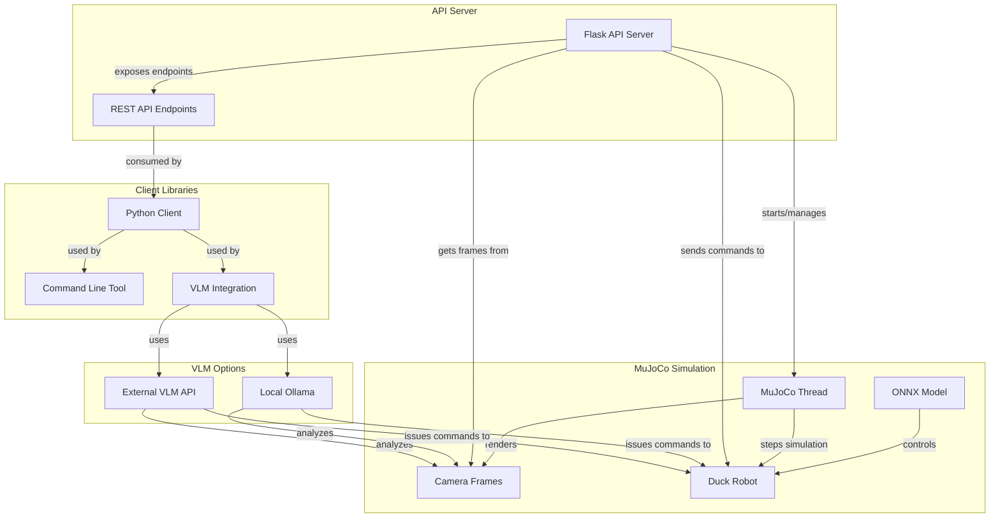
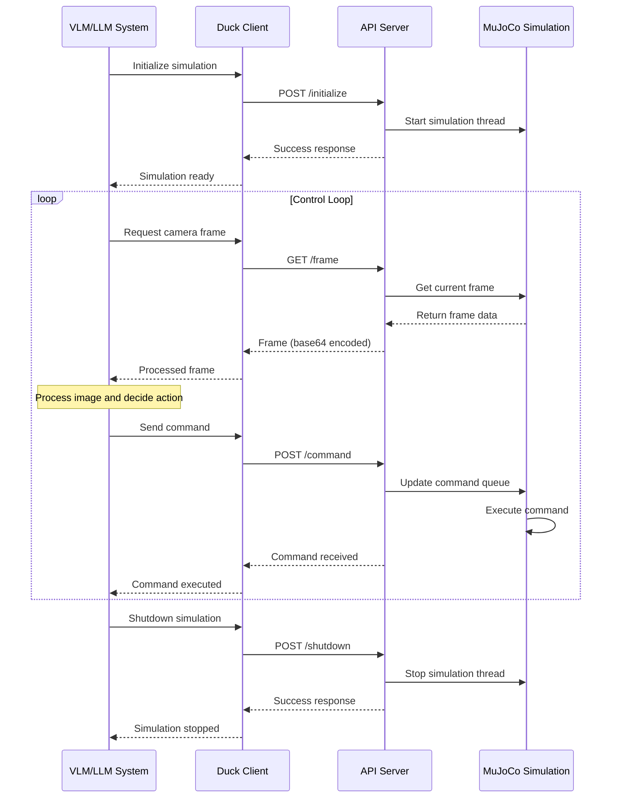
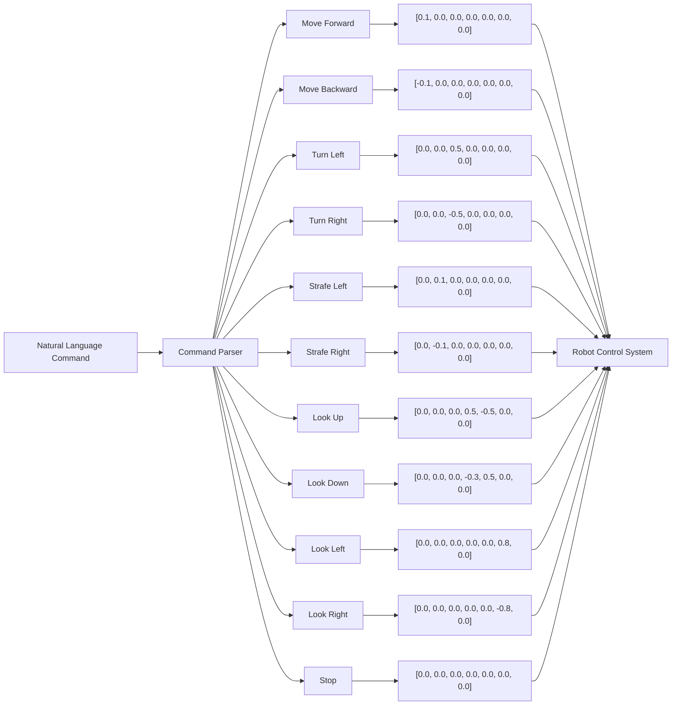
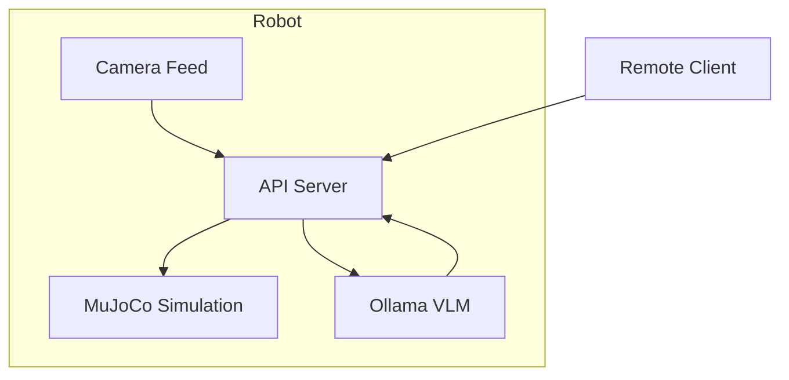
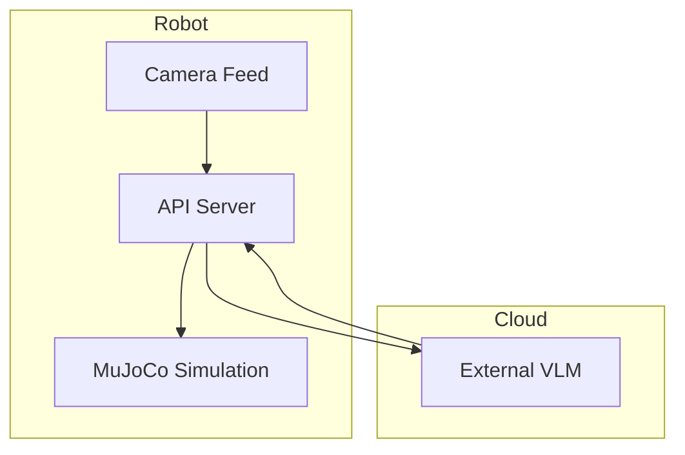
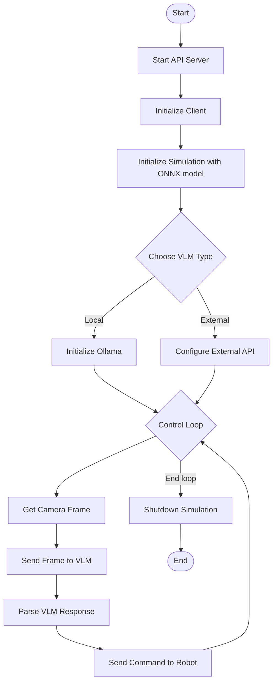

# Open Duck VLM Integration

This project provides an API and client libraries to allow Vision Language Models (VLMs) to control the Open Duck robot in MuJoCo simulation. The system enables external AI systems to view the robot's environment through camera frames and send movement commands.

## System Architecture



## Control Flow



## Natural Language Command Processing



## Files Overview

- `main.py`: Flask API server that interfaces with MuJoCo and exposes control endpoints
- `client.py`: Python client library for interacting with the API
- `vlm_integration.py`: Example implementation showing how a VLM can control the duck robot

## Installation

### Prerequisites

- Python 3.8+
- MuJoCo
- Open Duck Playground repository
- For local VLM: [Ollama](https://github.com/ollama/ollama) with llava or similar multimodal model

### Setup

1. Install dependencies:

```bash
pip install -e .
# or individually
pip install flask flask-cors pillow requests opencv-python numpy mujoco etils
```

2. Ensure you have trained an ONNX model for the Open Duck robot (or use a pre-trained one)

3. If using Ollama locally, install it:

```bash
# Linux
curl https://ollama.ai/install.sh | sh

# macOS
brew install ollama

# Windows
# Download installer from https://ollama.ai/download
```

4. Pull a multimodal model in Ollama:

```bash
ollama pull llava
```

## Usage

### Starting the API Server

```bash
# Using Python directly
python main.py --host 0.0.0.0 --port 5000

# Using UV
uv run main
```

Additional options:
- `--debug`: Enable debug mode

### Running with Local Ollama VLM (Recommended for Robot Deployment)

```bash
# Using Python directly
python vlm_integration.py --vlm-type=ollama --ollama-model=llava --onnx-model=path/to/model.onnx

# Using UV
uv run ollama-run
```

### Running with External VLM API

```bash
# Using Python directly
python vlm_integration.py --vlm-type=external --vlm-api=https://your-api-endpoint --onnx-model=path/to/model.onnx

# Using UV
uv run external-run https://your-api-endpoint
```

### Interactive Mode

```bash
# Using Python directly
python vlm_integration.py --interactive --onnx-model=path/to/model.onnx

# Using UV
uv run interactive
```

### Using the Client Library

The `client.py` module provides a Python client for interacting with the duck robot:

```python
from client import DuckRobotClient

# Initialize client
client = DuckRobotClient(api_url="http://localhost:5000")

# Initialize the MuJoCo simulation
client.initialize(onnx_model_path="path/to/duck_policy.onnx")

# Send a command
# Format: [vx, vy, omega, neck_pitch, head_pitch, head_yaw, head_roll]
client.send_direct_command([0.1, 0.0, 0.0, 0.0, 0.0, 0.0, 0.0])  # Move forward

# Get a camera frame
frame_data = client.get_frame()
with open("frame.png", "wb") as f:
    f.write(base64.b64decode(frame_data["image"]))

# Send a natural language command
client.send_nl_command("move forward and turn left")

# Shutdown when done
client.shutdown()
```

### Command-line Client

You can also use the client from the command line:

```bash
# Get status
python client.py status

# Initialize simulation
python client.py initialize --onnx-model-path path/to/duck_policy.onnx

# Send direct command (move forward)
python client.py direct --vx 0.1

# Send natural language command
python client.py nl "move forward and look left"

# Get a frame and save it
python client.py frame --output frame.png

# Shutdown
python client.py shutdown
```

## API Endpoints

The main API server provides these endpoints:

- `GET /status`: Get the status of the MuJoCo simulation
- `POST /initialize`: Initialize the MuJoCo simulation
- `POST /shutdown`: Shutdown the MuJoCo simulation
- `POST /command`: Send a command to the Duck Robot
- `GET /frame`: Get the current camera frame
- `GET /help`: Get API documentation

## Command Format

Direct commands to the duck robot use a 7-element array:

```
[vx, vy, omega, neck_pitch, head_pitch, head_yaw, head_roll]
```

Where:
- `vx`: Forward velocity (-0.15 to 0.2)
- `vy`: Lateral velocity (-0.2 to 0.2)
- `omega`: Angular velocity/turning (-1.0 to 1.0)
- `neck_pitch`: Neck pitch angle (-0.34 to 1.1)
- `head_pitch`: Head pitch angle (-0.78 to 0.78)
- `head_yaw`: Head yaw angle (-1.5 to 1.5)
- `head_roll`: Head roll angle (-0.5 to 0.5)

## VLM Integration Options

### Local Ollama (Recommended for Deployment)

For deployment on the robot itself, we recommend using Ollama for local inference:



Benefits:
- No internet connection required
- Lower latency
- Privacy (no data leaves the robot)
- Can run offline

Configuration options:
- `--ollama-url`: URL where Ollama is running (default: http://localhost:11434)
- `--ollama-model`: Model to use (default: llava)

### External VLM API

For development or to use more powerful models:



Configuration options:
- `--vlm-api`: URL of the external VLM API
- `--vlm-key`: API key for authentication (if required)

## Debugging

- All components include detailed logging
- The VLM integration saves frames to disk for debugging
- Use the `--debug` flag for more verbose output

## Example VLM Workflow



## Notes

- The MuJoCo simulation runs in a separate thread for improved performance
- Command queueing ensures smooth motion even with delayed VLM responses
- Natural language commands are mapped to direct commands using simple keyword matching
- Fixed initialization issue by setting default ONNX model path to "model.onnx"
- For deployment on a robot, the Ollama integration provides local inference capabilities