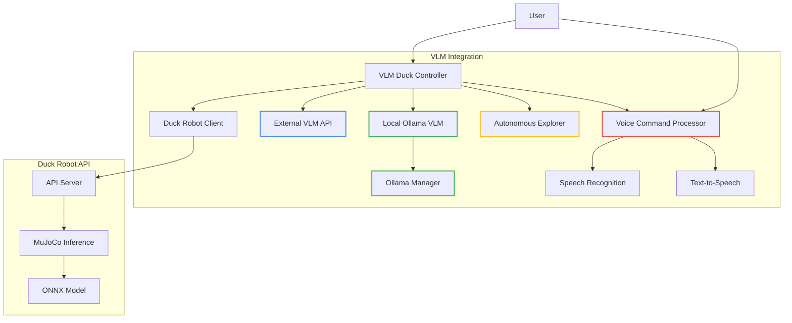
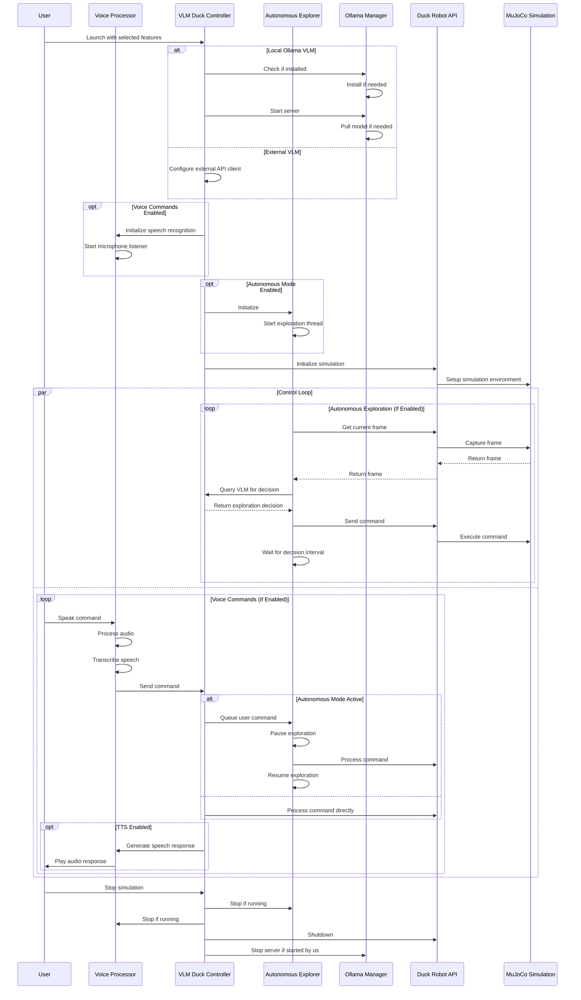
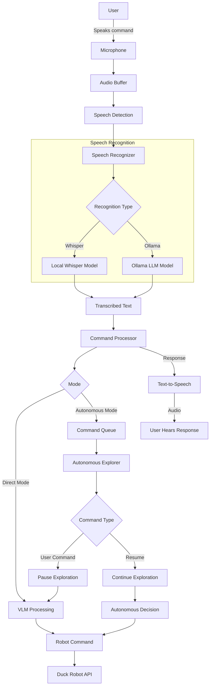

# D00t - Duck Robot VLM Integration

This project integrates Vision Language Models (VLMs) with the Open Duck Robot, enabling natural language control of the duck robot in the MuJoCo simulation environment.

## Project Overview

The integration allows users to:
1. Control the duck robot using natural language commands (text or voice)
2. Use vision-language models to interpret the robot's surroundings
3. Send appropriate commands based on visual input and language processing
4. Run in autonomous exploration mode with voice command interruption
5. Receive spoken feedback using text-to-speech capabilities

## Architecture



## Control Flow



## Voice Command Processing



## Installation

### Prerequisites

- Python 3.8 or higher
- MuJoCo environment
- ONNX model for Duck Robot control
- Microphone (for voice commands)
- Speakers (for text-to-speech)

### Setup

1. Clone the repository:
   ```bash
   git clone https://github.com/yourusername/d00t.git
   cd d00t
   ```

2. Install dependencies using UV:
   ```bash
   uv venv
   uv pip install -e .
   ```

3. Set up a VLM:
   - Option 1: **Local Ollama VLM** (recommended for robot deployment)
     ```bash
     # Install Ollama from https://ollama.com
     
     # Pull a vision-enabled model:
     ollama pull llava
     ```
     
   - Option 2: External VLM API (cloud-based solution)
     - Obtain API access to a vision-language model service

## Usage

### Quick Start

1. Install Ollama from [ollama.com](https://ollama.com)
2. Pull the required vision model:
   ```bash
   ollama pull llava
   ```
3. Run the system using the convenient start_robot.py script:
   ```bash
   uv run start_robot.py --autonomous --voice --tts
   ```
   
   This script will:
   - Check for the ONNX model in the current directory
   - Ensure Ollama is running (but won't install it)
   - Start the MuJoCo simulation
   - Enable autonomous exploration
   - Enable voice commands and text-to-speech

### Running with Ollama

### Prerequisites

1. Install Ollama from [ollama.com](https://ollama.com)
2. Make sure you have the required models:
   ```bash
   ollama pull llava  # For the basic vision model
   ollama pull bakllava  # For higher quality vision capabilities
   ```
3. Ensure your model.onnx file is in the root directory

### Basic Usage

Start the Duck Robot with Ollama as the VLM provider:

```bash
uv run vlm_integration.py --vlm-type ollama --ollama-model llava
```

With a custom system prompt:

```bash
uv run vlm_integration.py --vlm-type ollama --ollama-model llava --system-prompt "You are a helpful Duck Robot assistant that can see through a camera and respond to commands. You can move forward, backward, turn left or right, and look around."
```

### Voice Commands

To enable voice commands:

```bash
uv run vlm_integration.py --vlm-type ollama --ollama-model llava --voice --tts
```

### Autonomous Mode

To start in autonomous exploration mode:

```bash
uv run vlm_integration.py --vlm-type ollama --ollama-model llava --autonomous
```

### Combined Features

Full featured setup with all capabilities:

```bash
uv run vlm_integration.py --vlm-type ollama --ollama-model llava --voice --tts --autonomous --system-prompt "You are a helpful Duck Robot assistant that explores the environment autonomously and can respond to voice commands. You can see through your camera and describe what you see."
```

### Running with External VLM API

```bash
uv run vlm_integration.py --vlm-type external --vlm-api=https://your-vlm-api.com/vision --vlm-key=your-api-key
```

### Interactive Mode

Run in interactive mode to send direct commands:

```bash
uv run vlm_integration.py --interactive

# With voice commands
uv run vlm_integration.py --interactive --voice
```

## VLM Options

### Local Ollama VLM

The Ollama Manager utility (`ollama.py`) provides a convenient way to:

- Automatically install Ollama if not present
- Manage Ollama service lifecycle
- Pull and query vision-capable models
- Handle image-based prompts

Supported vision models:
- `llava` - Basic vision-language capabilities
- `bakllava` - Enhanced vision capabilities
- `llava-next` - Latest version with improved performance
- `gemma3:4b` - Smaller model suitable for TTS and STT

### Voice Recognition Options

The voice integration module supports:

- **Local Whisper**: Runs completely on the local machine with various model sizes
  - Options: tiny, base, small, medium, large
  - Tradeoff between accuracy and resource usage

- **Ollama-based Recognition**: Uses Ollama LLM for speech recognition
  - Requires vision-capable Ollama model
  - Processes audio inputs using the LLM

### Text-to-Speech Options

Speech synthesis is supported through:

- **Ollama TTS**: Uses Ollama LLM for generating speech
  - Same model as used for vision (e.g., gemma3:4b)
  - Quality varies by model

## API Endpoints

The Duck Robot API provides the following endpoints:

- `GET /status`: Check the status of the simulation
- `POST /initialize`: Initialize the simulation with an ONNX model
- `POST /command`: Send a command to the duck robot
- `POST /nl_command`: Send a natural language command
- `GET /frame`: Get the current frame from the simulation
- `POST /shutdown`: Shutdown the simulation

## Project Structure

```
d00t/
├── open_duck_mini_v2/         # Duck robot model
├── submodules/                # Submodules
│   └── open_duck_playground/  # Duck robot simulation code
├── main.py                    # API server
├── client.py                  # Client for the API server
├── vlm_integration.py         # VLM integration
├── ollama.py                  # Ollama manager utility
├── voice_integration.py       # Voice commands and TTS
├── start_robot.py             # Convenient startup script
└── README.md                  # This file
```

## Development

For development, install the additional development dependencies:

```bash
uv pip install -e ".[dev]"
```

## Deployment Recommendations

For deploying on the actual robot:

1. Use the Ollama VLM option for local inference to reduce latency
2. Pre-download the required models before deployment
3. Ensure the robot has sufficient GPU resources for VLM inference
4. Configure automatic startup of the Ollama service
5. For voice commands, use a high-quality microphone positioned near the expected users
6. Consider environmental noise when selecting the energy threshold for voice detection

## Voice Command Reference

| Command Type | Example Commands | Description |
|--------------|------------------|-------------|
| Movement | "move forward", "go back", "move left" | Controls basic movement |
| Rotation | "turn left", "turn right" | Controls rotation |
| Camera | "look up", "look down", "look around" | Controls camera orientation |
| Autonomous | "start exploring", "explore that area" | Controls autonomous exploration |
| System | "stop", "pause", "resume", "quit" | Controls system behavior |
| Custom | "find the red object", "go to the door" | Complex commands interpreted by VLM |

## License

[MIT License](LICENSE)

## Configuration

You can configure the Duck Robot system in several ways:

### 1. Using the Configuration File

The system uses a central `config.py` file that defines default settings. You can customize these settings by creating a user configuration file:

1. Create a directory for your settings:
   ```bash
   mkdir -p ~/.d00t
   ```

2. Create a configuration file based on the example:
   ```bash
   cp user_config_example.py ~/.d00t/config.py
   ```

### 2. Using Environment Variables

You can also set configuration using environment variables:

```bash
# Set Gemma 3 as the default model
export D00T_OLLAMA_MODEL=gemma3:4b

# Enable voice commands and TTS
export D00T_USE_VOICE=true
export D00T_USE_TTS=true

# Run with these settings
uv run start_robot.py
```

### 3. Using Command Line Arguments

Command line arguments override both environment variables and the configuration file:

```bash
uv run start_robot.py --ollama-model gemma3:4b --voice --tts
```

### Available Model Options

The following models are available in the configuration:

#### Vision Language Models
- `llava` - Basic vision-language model
- `bakllava` - Enhanced vision capabilities
- `llava-next` - Latest version with improved performance
- `gemma3:4b` - Smaller model suitable for TTS and STT
- `gemma2:9b` - Mid-sized model with good vision capabilities

#### Text-to-Speech Models
- `gemma3:4b` - Lightweight model for TTS
- `mistral:7b` - Mid-sized model for better TTS

#### Speech-to-Text Models
- `whisper:tiny` through `whisper:large` - Various sizes of Whisper
- `gemma3:4b` - Ollama-based speech recognition
