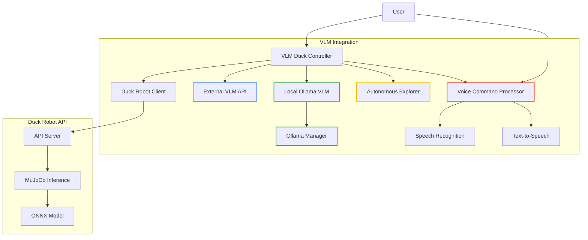
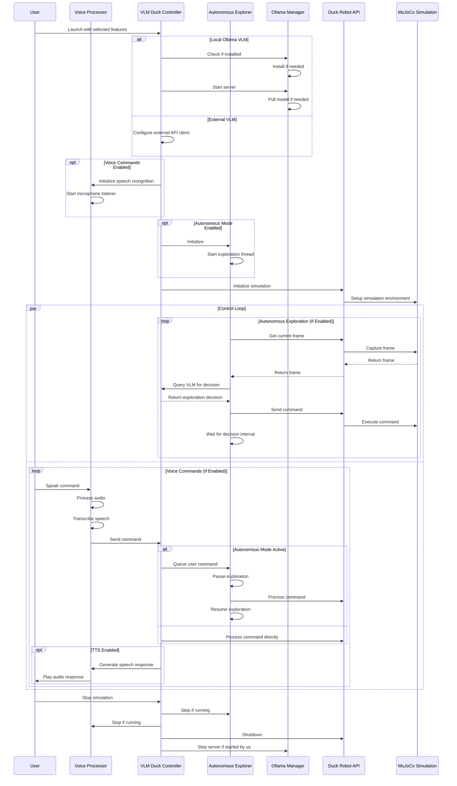
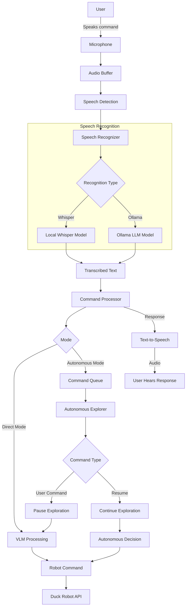

# Open Duck VLM Integration

This project integrates Vision Language Models (VLMs) with the Open Duck Robot, enabling natural language control of the duck robot in the MuJoCo simulation environment.

## Project Overview

The integration allows users to:
1. Control the duck robot using natural language commands (text or voice)
2. Use vision-language models to interpret the robot's surroundings
3. Send appropriate commands based on visual input and language processing
4. Run in autonomous exploration mode with voice command interruption
5. Receive spoken feedback using text-to-speech capabilities

## Architecture



## Control Flow



## Voice Command Processing



## Installation

### Prerequisites

- Python 3.8 or higher
- MuJoCo environment
- ONNX model for Duck Robot control
- Microphone (for voice commands)
- Speakers (for text-to-speech)

### Setup

1. Clone the repository:
   ```bash
   git clone https://github.com/yourusername/open_duck_vlm.git
   cd open_duck_vlm
   ```

2. Install dependencies using UV:
   ```bash
   uv venv
   uv pip install -e .
   ```

3. Set up a VLM:
   - Option 1: **Local Ollama VLM** (recommended for robot deployment)
     ```bash
     # Install and set up Ollama automatically
     uv run ollama-manager install
     
     # Or manually from https://ollama.com
     ```
     
   - Option 2: External VLM API (cloud-based solution)
     - Obtain API access to a vision-language model service

## Usage

### Running with Ollama (Local VLM)

```bash
# Start with default settings
uv run ollama-run

# With specific model
uv run ollama-run --ollama-model=llava-next

# Check available Ollama models
uv run ollama-manager list

# Pull a specific model
uv run ollama-manager pull llava
```

### With Voice Commands and TTS

```bash
# Enable voice commands with text-to-speech
uv run ollama-run --voice --tts

# Use Ollama for speech recognition and TTS
uv run ollama-run --voice --tts --ollama-stt --ollama-tts

# Test voice integration separately
uv run voice-test
```

### Autonomous Exploration Mode

```bash
# Start autonomous exploration
uv run autonomous

# With voice commands for interruption
uv run autonomous --voice --tts

# Specify exploration parameters
uv run autonomous --ollama-model=llava-next --voice --tts
```

### Running with External VLM API

```bash
uv run external-run --vlm-api=https://your-vlm-api.com/vision --vlm-key=your-api-key
```

### Interactive Mode

Run in interactive mode to send direct commands:

```bash
uv run interactive

# With voice commands
uv run interactive --voice
```

## VLM Options

### Local Ollama VLM

The Ollama Manager utility (`ollama.py`) provides a convenient way to:

- Automatically install Ollama if not present
- Manage Ollama service lifecycle
- Pull and query vision-capable models
- Handle image-based prompts

Supported vision models:
- `llava` - Basic vision-language capabilities
- `bakllava` - Enhanced vision capabilities
- `llava-next` - Latest version with improved performance
- `gemma3:4b` - Smaller model suitable for TTS and STT

### Voice Recognition Options

The voice integration module supports:

- **Local Whisper**: Runs completely on the local machine with various model sizes
  - Options: tiny, base, small, medium, large
  - Tradeoff between accuracy and resource usage

- **Ollama-based Recognition**: Uses Ollama LLM for speech recognition
  - Requires vision-capable Ollama model
  - Processes audio inputs using the LLM

### Text-to-Speech Options

Speech synthesis is supported through:

- **Ollama TTS**: Uses Ollama LLM for generating speech
  - Same model as used for vision (e.g., gemma3:4b)
  - Quality varies by model

## API Endpoints

The Duck Robot API provides the following endpoints:

- `GET /status`: Check the status of the simulation
- `POST /initialize`: Initialize the simulation with an ONNX model
- `POST /command`: Send a command to the duck robot
- `POST /nl_command`: Send a natural language command
- `GET /frame`: Get the current frame from the simulation
- `POST /shutdown`: Shutdown the simulation

## Project Structure

```
open_duck_vlm/
├── playground/                # Duck robot simulation code
│   └── open_duck_mini_v2/     # Duck robot model
│       ├── mujoco_infer.py    # MuJoCo inference
│       └── common/            # Common utilities
├── main.py                    # API server
├── client.py                  # Client for the API server
├── vlm_integration.py         # VLM integration
├── ollama.py                  # Ollama manager utility
├── voice_integration.py       # Voice commands and TTS
└── README.md                  # This file
```

## Development

For development, install the additional development dependencies:

```bash
uv pip install -e ".[dev]"
```

## Deployment Recommendations

For deploying on the actual robot:

1. Use the Ollama VLM option for local inference to reduce latency
2. Pre-download the required models before deployment
3. Ensure the robot has sufficient GPU resources for VLM inference
4. Configure automatic startup of the Ollama service
5. For voice commands, use a high-quality microphone positioned near the expected users
6. Consider environmental noise when selecting the energy threshold for voice detection

## Voice Command Reference

| Command Type | Example Commands | Description |
|--------------|------------------|-------------|
| Movement | "move forward", "go back", "move left" | Controls basic movement |
| Rotation | "turn left", "turn right" | Controls rotation |
| Camera | "look up", "look down", "look around" | Controls camera orientation |
| Autonomous | "start exploring", "explore that area" | Controls autonomous exploration |
| System | "stop", "pause", "resume", "quit" | Controls system behavior |
| Custom | "find the red object", "go to the door" | Complex commands interpreted by VLM |

## License

[MIT License](LICENSE)