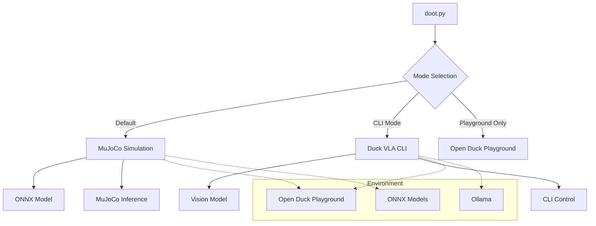

# Duck VLA Unified Runner (DOOT)

A simplified single-file solution for running the Duck VLA system with MuJoCo simulation.

## Quick Start

Run the Duck VLA simulation with a single command:

```bash
# Basic usage - will auto-detect ONNX model
uv run doot.py

# Setup environment first
uv run doot.py --setup

# Specify a specific ONNX model
uv run doot.py --onnx-model path/to/your/model.onnx

# Run with different vision model
uv run doot.py --vision-model llava
```

## Features

- **Single file** - No need to remember multiple script names
- **Auto-detection** - Automatically finds ONNX models in standard locations
- **Enhanced logging** - Detailed debug logging to help troubleshoot issues
- **Environment setup** - Built-in setup functionality

## Command Line Options

```
Simulation Mode:
  --cli-mode            Run with CLI control instead of ONNX model
  --playground-only     Run the Open Duck Playground directly without Duck VLA

Input/Output Options:
  --no-audio            Disable audio input/output
  --no-camera           Disable camera input

Model Options:
  --vision-model VISION_MODEL
                        Vision model to use (default: moondream)
  --onnx-model ONNX_MODEL
                        Path to specific ONNX model file (will auto-detect if not specified)

Environment Setup:
  --setup               Run setup to ensure environment is ready
  --test-imports        Test if playground imports work correctly

Other options:
  --debug               Enable debug logging
```

## Architecture

The Duck VLA runner architecture uses the following components:


```mermaid
graph TD
    A[doot.py] --> B{Mode Selection}
    B -->|Default| C[MuJoCo Simulation]
    B -->|CLI Mode| D[Duck VLA CLI]
    B -->|Playground Only| E[Open Duck Playground]
    
    C --> F[ONNX Model]
    C --> G[MuJoCo Inference]
    
    D --> H[Vision Model]
    D --> I[CLI Control]
    
    subgraph Environment
        J[Open Duck Playground]
        K[Ollama]
        L[ONNX Models]
    end
    
    C -.-> J
    D -.-> J
    D -.-> K
    C -.-> L
```

## Environment Setup

The system requires:

1. **Open Duck Playground** - Cloned automatically with `--setup`
2. **Ollama** - For vision model support
3. **ONNX model** - Place in `duck_vla/onnx/` directory

Run the setup command to prepare your environment:

```bash
uv run doot.py --setup
```

## Troubleshooting

Common issues and solutions:

1. **No ONNX model found:**
   - Place an ONNX model in `duck_vla/onnx/` directory
   - Use `--onnx-model` to specify a model explicitly

2. **Import errors:**
   - Run `uv run doot.py --setup` to set up the environment
   - Run `uv run doot.py --test-imports` to verify imports work

3. **Vision model issues:**
   - Ensure Ollama is installed and running
   - Check that the model is available with `ollama list`

## License

This project is licensed under the MIT License - see LICENSE for details.
