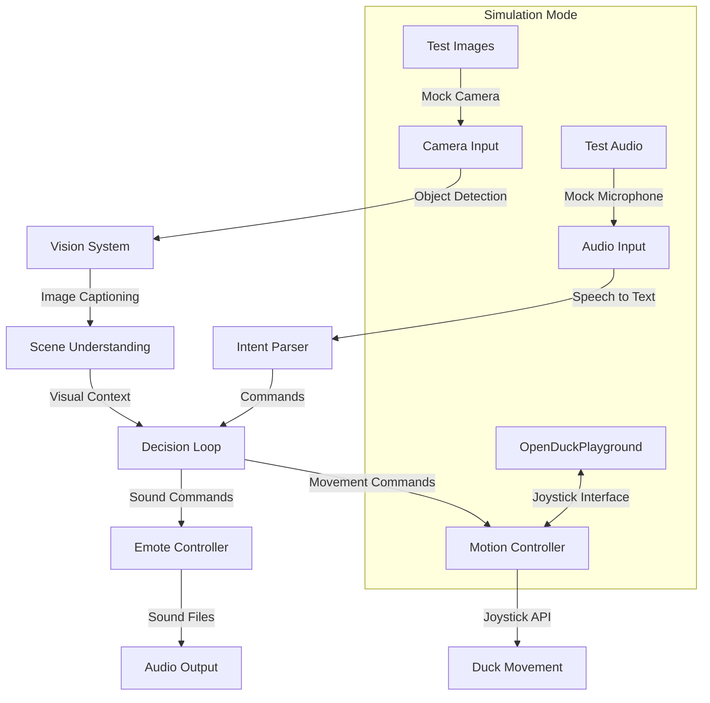

#  d00t VLA: Vision-Language-Action Control System


This project enables a duck droid to autonomously move, observe, and respond to people using a **Vision-Language-Action (VLA)** stack. It runs on a **Radxa Zero 3W** locally, and an Raspberry Pi Zero 2 W with an API key. It integrates an Arducam, speaker, and microphone. The droid already supports walking and expressive emotes controlled by an Xbox joystick — this adds autonomous reasoning on top.

---

## 🎯 Goal

To build a modular system that allows the duck to:
- Understand voice commands (e.g., "Come here", "Look at the red ball")
- See its environment using an Arducam
- Reason about what it sees using a lightweight VLM (like Moondream)
- Move, turn, strafe, and emote autonomously using joystick-like APIs
- Respond with expressive beep sounds (no TTS required)

---

## 🧱 Project Structure

Note: we also have a submodule called OpenDuckPlayground that uses MuJoCo to simulate the droid, where this will be tested. This submodule has items such as joystick.py and others

```
duck_vla/
├── camera/
│   ├── arducam_capture.py         # Capture frames from Arducam
│   └── object_detector.py         # Object detection models (e.g. YOLOv8-tiny)
│
├── vision/
│   └── moondream_wrapper.py       # Captioning and visual Q&A using Moondream
│
├── language/
│   ├── stt.py                     # Speech-to-text (Vosk or Whisper.cpp)
│   ├── intent_parser.py           # Maps phrases to structured commands
│
├── action/
│   ├── joystick_interface.py      # Interface to existing joystick-style motor control
│   ├── motion_controller.py       # Maps intents to movement commands
│   ├── emotes.py                  # Triggers emote beeps and sound effects
│
├── brain/
│   └── decision_loop.py           # Main controller: vision + language → action
│
├── utils/
│   └── audio.py                   # Utility for recording and playing beeps
│
├── sounds/                        # Folder for WAV beep/emote sounds
│
├── models/                        # Store downloaded models (e.g. .onnx or .bin)
│
├── tests/                         # Test suite for the project
│   ├── test_simulation.py         # Tests for simulation mode
│   └── README.md                  # Documentation for running tests
│
├── run_duck.py                    # Entrypoint script
└── requirements.txt               # Python dependencies
```

---

## 🛠️ Setup Instructions

1. **Install dependencies**:
   ```bash
   pip install -e .
   # Or with development dependencies
   pip install -e ".[dev]"
   ```

2. **Download models**:
   - Moondream: from Hugging Face (`huggingface/Moondream1`)
   - Optional: YOLOv8-tiny or RT-DETR ONNX model
   - Vosk speech recognition model

3. **Test camera input**:
   ```bash
   python -m duck_vla.camera.arducam_capture
   ```

4. **Run the duck**:
   ```bash
   # Run on hardware
   python -m duck_vla.run_duck
   
   # Run in simulation mode with proper Python path
   uv run run_duck_sim.py
   
   # Run in simulation mode with debug logging
   uv run run_duck_sim.py --debug
   
   # Run without audio/camera (for testing)
   uv run run_duck_sim.py --no-audio --no-camera
   
   # Run the Open Duck Playground directly (MuJoCo visualization)
   uv run run_playground.py
   
   # Run MuJoCo inference with a pre-trained ONNX model
   uv run run_mujoco_duck.py
   ```

5. **Run tests**:
   ```bash
   # Run all tests
   python -m pytest duck_vla/tests/
   
   # Run simulation tests
   python -m pytest duck_vla/tests/test_simulation.py
   ```

---

## 🧠 How It Works

- **Voice Input:** Duck listens using mic and transcribes speech with STT
- **Command Parsing:** Maps "Come here" → `follow_person` intent
- **Visual Input:** Captures frame and captions it using Moondream
- **Spatial Reasoning:** Identifies object location from bounding box or caption
- **Action Layer:** Converts intent + visual context into joystick-style movement
- **Response Output:** Plays matching emote sound effect from `sounds/`

---

## 🔄 Simulation Mode

The project includes a simulation mode that uses the OpenDuckPlayground to test functionality without hardware:

- Uses MuJoCo physics simulation for the duck's movement
- Simulates camera input with test images or synthetic data
- Allows testing of decision-making logic and movement
- Helpful for development and testing without physical hardware

To run in simulation mode:
```bash
# Running with proper Python path setup
uv run run_duck_sim.py --debug

# Running the Open Duck Playground directly (to see MuJoCo simulation)
uv run run_playground.py

# Running MuJoCo inference with a pre-trained model
uv run run_mujoco_duck.py
```

The repository includes three helper scripts for running simulations:

1. `run_duck_sim.py` - Runs the Duck VLA system in simulation mode with the proper Python path
2. `run_playground.py` - Runs the Open Duck Playground directly, showing the MuJoCo visualization 
3. `run_mujoco_duck.py` - Runs MuJoCo inference with a pre-trained ONNX model

These scripts ensure the proper Python path is set up for accessing the `playground` module.

---

## 🗣️ Example Behaviors

| Command                  | Behavior                                  |
|--------------------------|-------------------------------------------|
| "BD, come here"      | Detects person, walks to them, beeps happily |
| "What do you see?"       | Captions image and plays curious beep     |
| "Turn around"            | Executes a 180° turn with dramatic beep   |
| "Wave hello!"            | Plays a friendly wave beep emote          |
| "Look at the red ball"   | Turns head toward object, plays beep      |

---

## 📊 System Architecture


```mermaid
graph TD
    A[Audio Input] -->|Speech to Text| B[Intent Parser]
    C[Camera Input] -->|Object Detection| D[Vision System]
    D -->|Image Captioning| E[Scene Understanding]
    B -->|Commands| F[Decision Loop]
    E -->|Visual Context| F
    F -->|Movement Commands| G[Motion Controller]
    F -->|Sound Commands| H[Emote Controller]
    G -->|Joystick API| I[Duck Movement]
    H -->|Sound Files| J[Audio Output]
    
    subgraph "Simulation Mode"
    K[OpenDuckPlayground] <-->|Joystick Interface| G
    L[Test Images] -->|Mock Camera| C
    M[Test Audio] -->|Mock Microphone| A
    end
```

---

## ✅ Roadmap

- [x] Update Python dependency to 3.10+ (required by playground)
- [x] Create simulation tests
- [ ] Integrate Moondream for on-device image captioning
- [ ] Use Vosk for offline STT
- [ ] Build rule-based intent parser for basic commands
- [ ] Wrap movement/emote functions from joystick control
- [ ] Assign beep files to different moods and intents
- [ ] Add fallback sound for unknown commands or states

---

## Requirements

- Python 3.10+
- Radxa Zero 3W (8GB RAM recommended)
- Arducam camera
- Microphone + speaker
- Emote sound effects (WAV files)
- UV

---

## Models
- Hugging Face [Moondream](https://huggingface.co/spaces/huggingface/Moondream)
- [YOLOv8](https://github.com/ultralytics/ultralytics)
- [Vosk Speech Recognition](https://alphacephei.com/vosk/)
