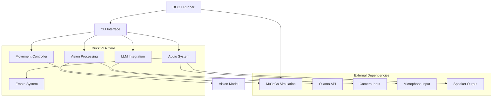
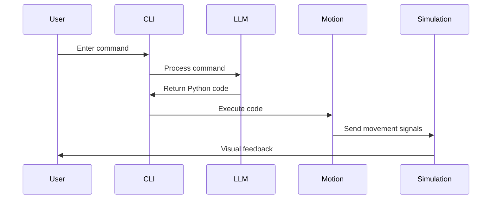
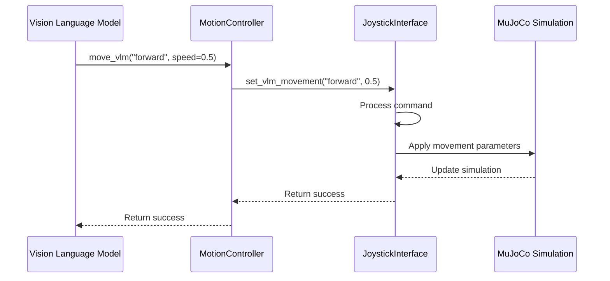

# Duck VLA Unified Runner (DOOT)

DOOT consolidates all Duck VLA simulation functionality into a single command-line tool. It focuses on MuJoCo inference simulation with options for various configurations.

## Architecture

DOOT consists of several key components that work together to provide a comprehensive simulation environment:


```mermaid
graph TD
    DOOT[DOOT Runner] --> CLI[CLI Interface]
    DOOT --> Mujoco[MuJoCo Simulation]
    
    CLI --> LLM[LLM Integration]
    CLI --> Movement[Movement Controller]
    CLI --> Audio[Audio System]
    CLI --> Vision[Vision Processing]
    
    LLM --> Ollama[Ollama API]
    
    Movement --> Mujoco
    
    Vision --> Camera[Camera Input]
    Vision --> VisionModel[Vision Model]
    
    Audio --> Microphone[Microphone Input]
    Audio --> Speaker[Speaker Output]
    Audio --> Emotes[Emote System]
    
    subgraph "Duck VLA Core"
        LLM
        Movement
        Audio
        Vision
        Emotes
    end
    
    subgraph "External Dependencies"
        Ollama
        Mujoco
        Camera
        Microphone
        Speaker
    end
```

## System Flow


```mermaid
sequenceDiagram
    participant User
    participant CLI
    participant LLM
    participant Motion
    participant Simulation
    
    User->>CLI: Enter command
    CLI->>LLM: Process command
    LLM->>CLI: Return Python code
    CLI->>Motion: Execute code
    Motion->>Simulation: Send movement signals
    Simulation->>User: Visual feedback
```

## Key Components

- **CLI Controller**: Provides command-line interface for user interaction
- **Central Model**: Manages interactions with LLMs via Ollama
- **Movement Controller**: Translates commands into motion
- **Audio System**: Handles sound input/output and emotes
- **Vision Processing**: Processes camera input and provides environmental awareness

## Usage

```bash
# Run with CLI control
uv run doot.py --cli-mode

# Enable debug logging
uv run doot.py --cli-mode --debug

# Disable audio/camera
uv run doot.py --cli-mode --no-audio --no-camera

# Run the Open Duck Playground directly
uv run doot.py --playground-only

# Set up the environment
uv run doot.py --setup
```

## CLI Commands

When running in CLI mode, the following commands are available:

- `help` - Display available commands
- `walk forward` - Walk forward (natural language commands work)
- `stop` - Stop all movement
- `check_ollama` - Check Ollama connectivity
- `status` - Show system status
- `emote happy` - Express an emotion
- `exit` / `quit` - Exit the CLI

## Recent Updates

- Fixed streaming response handling to prevent CLI hanging
- Improved error handling for Ollama API interactions
- Reduced redundant audio system initialization 
- Added proper cleanup for audio resources
- Added timeout mechanisms to prevent infinite loops

## Features

- **Single file** - No need to remember multiple script names
- **Auto-detection** - Automatically finds ONNX models in standard locations
- **Enhanced logging** - Detailed debug logging to help troubleshoot issues
- **Environment setup** - Built-in setup functionality
- **VLM Movement Commands** - Support for Vision Language Model movement commands

## Command Line Options

```
Simulation Mode:
  --cli-mode            Run with CLI control instead of ONNX model
  --playground-only     Run the Open Duck Playground directly without Duck VLA

Input/Output Options:
  --no-audio            Disable audio input/output
  --no-camera           Disable camera input

Model Options:
  --vision-model VISION_MODEL
                        Vision model to use (default: gemma3)
  --onnx-model ONNX_MODEL
                        Path to specific ONNX model file (will auto-detect if not specified)

Environment Setup:
  --setup               Run setup to ensure environment is ready
  --test-imports        Test if playground imports work correctly

Other options:
  --debug               Enable debug logging
```

## Movement Control System

The Duck VLA system includes a comprehensive movement control system that supports both traditional joystick controls and Vision Language Model (VLM) movement commands.

### Components

1. **JoystickInterface** (`joystick_interface.py`)
   - Provides a direct interface for controlling duck movement in MuJoCo simulation
   - Supports both traditional joystick controls and VLM movement commands
   - Handles command processing, parameter scaling, and head position control

2. **MotionController** (`motion_controller.py`)
   - High-level interface for controlling duck movement
   - Translates movement commands into joystick inputs
   - Supports both simulation and real-world environments
   - Includes specialized `SimulatedMotionController` for enhanced debugging

### VLM Movement Commands

The system now supports the following VLM movement commands:

- `forward` - Move forward
- `backward` - Move backward
- `left` - Strafe left
- `right` - Strafe right
- `turn_left` - Turn left
- `turn_right` - Turn right
- `stop` - Stop all movement

Example usage:

```python
# Initialize the motion controller
controller = MotionController(simulate=True)

# Move forward using VLM command
controller.move_vlm("forward", speed=0.5, duration=2.0)

# Turn left using VLM command
controller.move_vlm("turn_left", speed=0.3, duration=1.5)

# Stop movement
controller.move_vlm("stop")
```

### Movement Flow


```mermaid
sequenceDiagram
    participant VLM as Vision Language Model
    participant MC as MotionController
    participant JI as JoystickInterface
    participant MJ as MuJoCo Simulation
    
    VLM->>MC: move_vlm("forward", speed=0.5)
    MC->>JI: set_vlm_movement("forward", 0.5)
    JI->>JI: Process command
    JI->>MJ: Apply movement parameters
    MJ-->>JI: Update simulation
    JI-->>MC: Return success
    MC-->>VLM: Return success
```

## Environment Setup

The system requires:

1. **Open Duck Playground** - Cloned automatically with `--setup`
2. **Ollama** - For vision model support
3. **ONNX model** - Place in `duck_vla/onnx/` directory
4. **System dependencies** - Required for audio and camera

### System Dependencies

Before running, install these system dependencies:

```bash
# Ubuntu/Debian
sudo apt-get update
sudo apt-get install -y portaudio19-dev libv4l-dev python3-opencv

# Fedora/RHEL
sudo dnf install -y portaudio-devel libv4l-devel python3-opencv
```

> **IMPORTANT**: PortAudio (portaudio19-dev) is a system library that must be installed **before** installing Python packages like `pyaudio`. It cannot be installed through pip or uv.

### Python Setup

Run the setup command to prepare your environment:

```bash
# Set up the Python environment
uv run doot.py --setup

# Or use our setup script which handles system dependencies
./setup_system_deps.sh
```

## Running Without Hardware

If you don't have camera or microphone hardware, you can still run with VLM processing:

```bash
# Run with CLI mode and no hardware, but keep VLM processing
uv run doot.py --cli-mode --vision-model gemma3
```

You can then interact with the system through the CLI interface without needing actual hardware.

## Troubleshooting

Common issues and solutions:

1. **No ONNX model found:**
   - Place an ONNX model in `duck_vla/onnx/` directory
   - Use `--onnx-model` to specify a model explicitly

2. **Import errors:**
   - Run `uv run doot.py --setup` to set up the environment
   - Run `uv run doot.py --test-imports` to verify imports work

3. **Ollama issues:**
   - Ensure Ollama is installed and running with `ollama serve`
   - Check that the model is available with `ollama list`
   - Pull required models with `ollama pull gemma:latest`
   - The Duck VLA system exclusively uses Ollama for LLM functionality

4. **PortAudio library not found:**
   - Install the portaudio development package with `sudo apt install portaudio19-dev`
   - Reinstall related Python packages: `uv pip install --force-reinstall sounddevice pyaudio`

5. **Camera not found or access error:**
   - Check camera permissions: `ls -la /dev/video*`
   - Add your user to the video group: `sudo usermod -a -G video $USER`
   - Install required libraries: `sudo apt install libv4l-dev`

6. **Movement command issues:**
   - Check that the joystick interface is enabled
   - Verify that the movement command is supported
   - Check the debug logs for detailed error information

## License

This project is licensed under the MIT License - see LICENSE for details.
