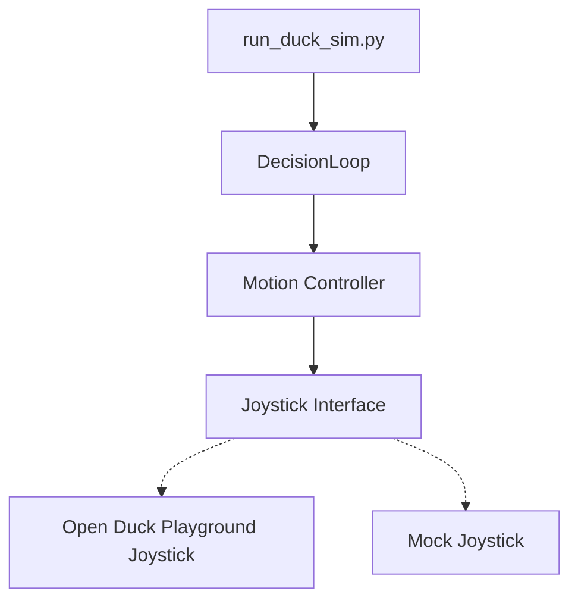

# Duck VLA Simulation Guide

This document explains how to run the Duck VLA system in simulation mode and the architecture used to interface with the Open Duck Playground.

## Quick Start

Run the duck simulation using one of these commands:

```bash
# Run the Duck VLA system in simulation mode
uv run run_duck_sim.py

# Run with debug logging
uv run run_duck_sim.py --debug

# Run without audio/camera inputs
uv run run_duck_sim.py --no-audio --no-camera

# Run the Open Duck Playground directly (MuJoCo visualization)
uv run run_playground.py

# Run MuJoCo inference with a pre-trained ONNX model
uv run run_mujoco_duck.py
```

## Architecture Overview

The Duck VLA simulation architecture is designed with these components:



### Key Components

1. **Motion Controller** (`duck_vla/action/motion_controller.py`):
   - Provides high-level movement commands
   - Has separate `SimulatedMotionController` class for simulation mode
   - Uses `JoystickInterface` for actual control

2. **Joystick Interface** (`duck_vla/action/joystick_interface.py`):
   - Abstracts the joystick control interface
   - Handles Python path setup for accessing the playground module
   - Falls back to mock implementation when needed

3. **Helper Scripts**:
   - `run_duck_sim.py` - Runs the Duck VLA system with proper Python path
   - `run_playground.py` - Runs the Open Duck Playground directly
   - `run_mujoco_duck.py` - Runs MuJoCo inference with a pre-trained model

## Error Handling

The simulation has several fallback layers:

1. If the Open Duck Playground can't be imported, it falls back to a mock joystick interface
2. If the joystick interface fails, the motion controller creates a local mock
3. If the ONNX model isn't found, it will search in multiple locations

## Python Path Management

The key challenge with running the simulation was the Python path management. The Open Duck Playground module needs to be in the Python path, which can be done in several ways:

1. Using `sys.path.insert()` to add the module path programmatically
2. Setting the `PYTHONPATH` environment variable
3. Using `uv run` which properly handles virtual environments

Our solution uses a combination of these approaches, with the helper scripts handling the path configuration automatically.

## Common Issues and Solutions

1. **"No module named 'playground'"**:
   - This means the Open Duck Playground module isn't in the Python path
   - Solution: Use one of the helper scripts (`run_duck_sim.py`, etc.)

2. **"No such file or directory: 'polynomial_coefficients.pkl'"**:
   - The reference motion data file is missing
   - Solution: The system will fall back to a mock implementation

3. **"No window appears in simulation mode"**:
   - The simulation is running but without visual output
   - Solution: Use `run_playground.py` to run the MuJoCo visualization

## Future Improvements

1. Add support for more simulation scenarios and terrains
2. Improve the mapping between Duck VLA commands and simulation API
3. Add a simple UI for controlling the simulation parameters
4. Support better debugging and visualization tools 