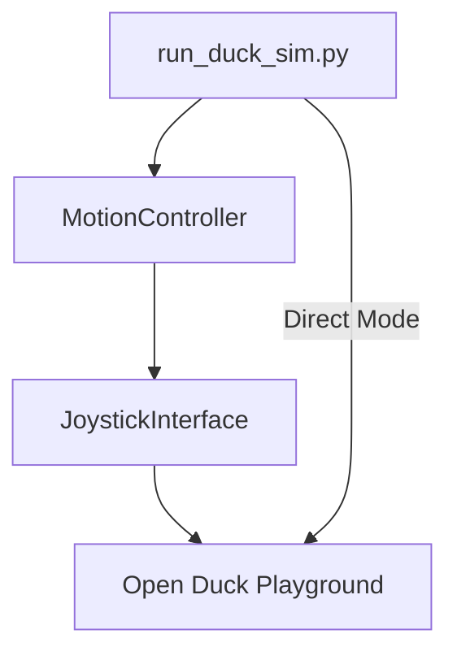

# Duck VLA Simulation Guide

This document explains how to run the Duck VLA system in simulation mode using the unified `run_duck_sim.py` script.

## Quick Start

Run the duck simulation using one command:

```bash
# Run the Duck VLA system in simulation mode
uv run run_duck_sim.py
```

## Available Options

```bash
# Show all available options
uv run run_duck_sim.py --help

# Run with debug logging
uv run run_duck_sim.py --debug

# Run without audio/camera inputs
uv run run_duck_sim.py --no-audio --no-camera

# Run just the MuJoCo visualization
uv run run_duck_sim.py --mujoco-only

# Run the Open Duck Playground directly
uv run run_duck_sim.py --playground-only

# Specify a different vision model (requires Ollama)
uv run run_duck_sim.py --vision-model gemma3
```

## ONNX Model Management

The system uses the first ONNX model it finds in the `duck_vla/onnx` directory. To use a different model:

1. Place your .onnx file in the `duck_vla/onnx` directory
2. The system will automatically use it

## Architecture Overview

The Duck VLA simulation architecture uses these components:



### Key Components

1. **Motion Controller** (`duck_vla/action/motion_controller.py`):
   - Provides high-level movement commands with extensive debug logging
   - Uses the `SimulatedMotionController` class for simulation mode
   - Automatically detects ONNX models from environment variables

2. **Unified Runner** (`run_duck_sim.py`):
   - Single command to run all simulation modes
   - Handles all configuration options
   - Sets up environment variables and paths automatically

## Common Issues and Solutions

1. **"No module named 'playground'"**:
   - This means the Open Duck Playground module isn't in the Python path
   - Solution: Run `./setup_duck_vla.sh` to set up the environment

2. **"No ONNX model found"**:
   - The system couldn't find an ONNX model in the duck_vla/onnx directory
   - Solution: Place an ONNX model in the duck_vla/onnx directory

3. **Ollama model issues**:
   - If you encounter issues with Ollama models, they need to be installed manually
   - Solution: Run `ollama pull modelname` to install required models 