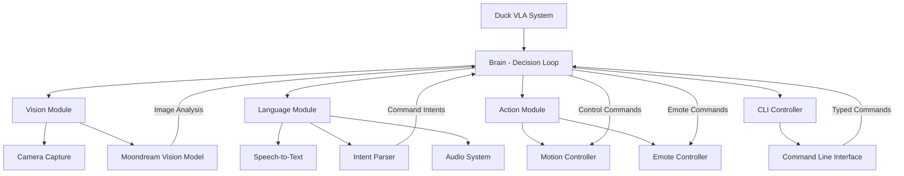
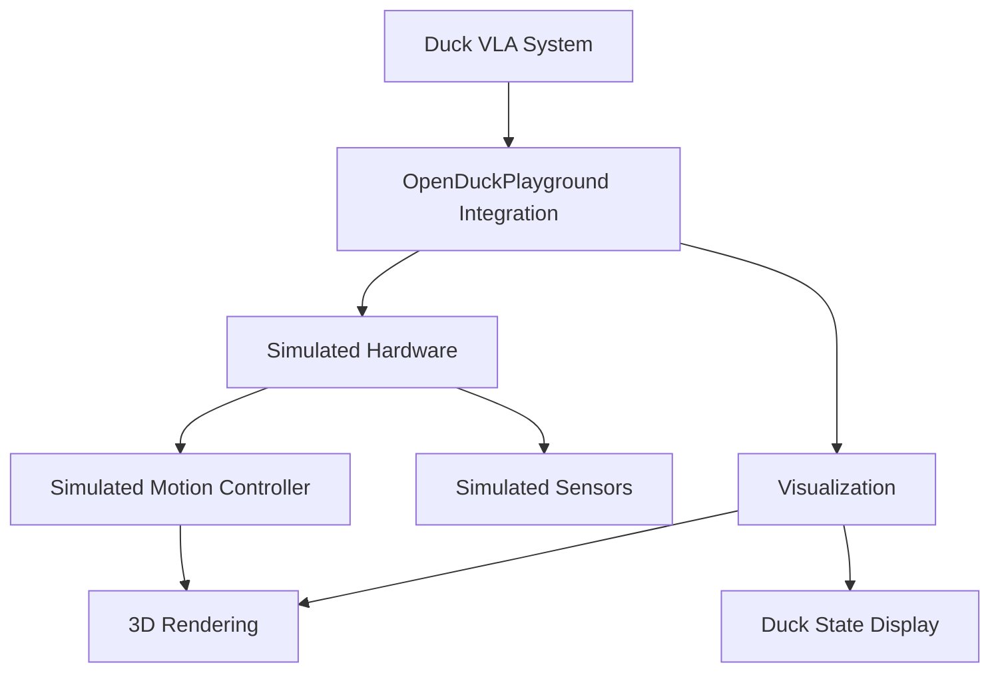

# Duck VLA (Vision-Language-Action) System

Duck VLA is a control system for robotic ducks that integrates vision, language understanding, and action capabilities.

## Architecture

The Duck VLA system is organized into several interconnected modules:



## Components

### Brain Module

The `brain` module contains the core decision-making loop:

- **DecisionLoop**: Coordinates all system components, processes inputs, and determines actions.

### Vision Module

The `vision` module includes:

- **MoondreamVision**: Provides image understanding using either Hugging Face or Ollama backends.
- **ArduCamCapture**: Interfaces with the camera hardware.

### Language Module

The `language` module includes:

- **SpeechToText**: Converts spoken audio to text.
- **IntentParser**: Analyzes text to determine user intentions.
- **AudioSystem**: Manages audio playback and capture.

### Action Module

The `action` module includes:

- **MotionController**: Controls duck movement (walking, turning, head position).
- **EmoteController**: Manages emotional expressions and sounds.

### CLI Controller

- **CLIController**: Provides a command-line interface for direct control without using voice.

## Backend Options

Vision capabilities are provided through:

1. **Ollama**: A local AI model server (default).
2. **Hugging Face**: Cloud or locally downloaded models.

## Data Flow

1. **Input**: 
   - Camera images from ArduCamCapture
   - Voice commands from SpeechToText
   - Typed commands from CLIController

2. **Processing**:
   - Vision analysis with MoondreamVision
   - Command interpretation with IntentParser
   - Decision making in DecisionLoop

3. **Output**:
   - Physical movement via MotionController
   - Sounds and expressions via EmoteController

## Simulation Mode

The system can run in simulation mode which:
- Uses SimulatedMotionController instead of real hardware
- Integrates with OpenDuckPlayground for visualization



## Usage

### Installation

1. Run the setup script to install dependencies:
   ```
   ./setup_duck_vla.sh
   ```

2. Ensure Ollama is running:
   ```
   ollama serve
   ```

### Running the System

- **Run with all features**:
  ```
  uv run run_duck_sim.py
  ```

- **Run with CLI only (no audio/speech)**:
  ```
  uv run run_duck_sim.py --no-audio
  ```

- **Run in simulation mode**:
  ```
  uv run run_duck_sim.py --simulate
  ```

### CLI Commands

- `move <direction> [speed] [duration]` - Move the duck (forward, backward, left, right)
- `turn <direction> [rate] [angle]` - Turn the duck (left, right, around)
- `look at <target>` - Point the duck's head at a target (person, up, down, left, right)
- `look <yaw,pitch,roll>` - Set specific head angles
- `emote <name>` - Play an emote/sound
- `stop` - Stop all movement
- `status` - Get current duck status
- `exit/quit` - Exit the CLI controller 