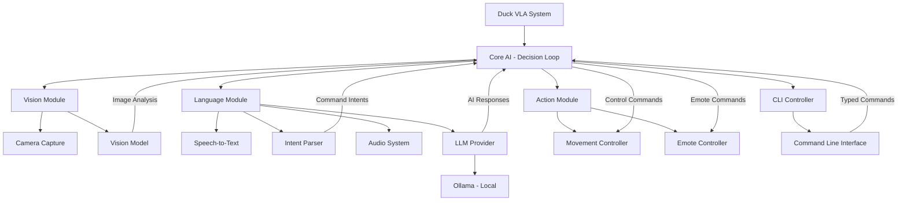
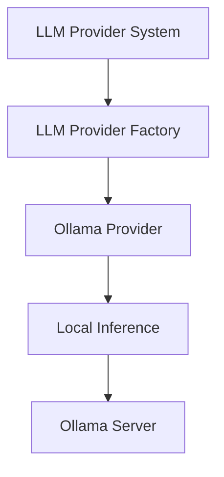
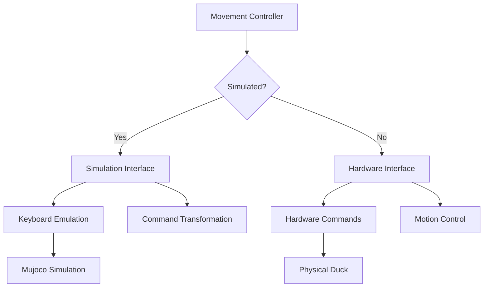

# Duck VLA (Vision-Language-Action) System

Duck VLA is a control system for robotic ducks that integrates vision, language understanding, and action capabilities.

## Architecture

The Duck VLA system is organized into several interconnected modules:



## Components

### Core AI Module

The `core_ai` module contains the core AI components:

- **DecisionLoop**: Coordinates all system components, processes inputs, and determines actions.
- **CentralModel**: Manages AI interactions through different LLM providers.
- **IntentParser**: Analyzes text to determine user intentions.

### Vision Module

The `vision` module includes:

- **ArduCamCapture**: Interfaces with the camera hardware.

### Language Module

The `language` module includes:

- **SpeechToText**: Converts spoken audio to text.
- **AudioSystem**: Manages audio playback and capture.
- **LLMProvider**: Abstract interface to different AI providers (Ollama, OpenAI, Anthropic)

### Action Module

The `action` module includes:

- **Movement**: Controls duck movement in both real and simulated environments.
- **EmoteController**: Manages emotional expressions and sounds.

### CLI Controller

- **CLIController**: Provides a command-line interface for direct control without using voice.

## LLM Provider

Duck VLA uses Ollama as its LLM provider:

1. **Ollama**: Runs locally, providing completely offline operation.
   - Fast, private, and doesn't require internet access
   - Supports various models like Mistral, Llama, Gemma, etc.
   - Recommended models: gemma:latest, mistral:latest, or llama3:latest



## Movement Controller

The Movement controller provides a unified interface for both simulated and real robot:

1. **Simulation Mode**: Controls the duck in OpenDuckPlayground's simulation environment.
   - Maps to key presses/commands as defined in mujoco_infer.py
   - Supports all movement and head position commands

2. **Real Hardware Mode**: Controls the physical duck robot.
   - Maps to commands as defined in v2_rl_walk_mujoco.py
   - Emulates controller inputs that would normally come from an Xbox controller



## Data Flow

1. **Input**: 
   - Camera images from ArduCamCapture
   - Voice commands from SpeechToText
   - Typed commands from CLIController

2. **Processing**:
   - Command interpretation with IntentParser
   - AI processing with CentralModel (via chosen LLM provider)
   - Decision making in DecisionLoop

3. **Output**:
   - Physical movement via Movement controller
   - Sounds and expressions via EmoteController

## Simulation Mode

The system can run in simulation mode which:
- Uses the Movement controller in simulation mode
- Integrates with OpenDuckPlayground for visualization

## Usage

### Installation

1. Run the setup script to install dependencies:
   ```
   ./setup_duck_vla.sh
   ```

2. Ensure Ollama is running:
   ```
   ollama serve
   ```

3. Pull a model for Ollama:
   ```
   ollama pull gemma:latest
   ```

### Running the System

- **Run with all features (using Ollama)**:
  ```
  python -m duck_vla.run_duck
  ```

- **Run with a specific Ollama model**:
  ```
  python -m duck_vla.run_duck --llm-model llama3:latest
  ```

- **Run with CLI only (no audio/speech)**:
  ```
  python -m duck_vla.run_duck --no-audio
  ```

- **Run in simulation mode**:
  ```
  python -m duck_vla.run_duck --simulate
  ```

- **Run with debug logging**:
  ```
  python -m duck_vla.run_duck --debug
  ```

### Command Line Arguments

```
usage: run_duck.py [-h] [--debug] [--simulate] [--no-audio] [--no-camera] [--no-cli]
                  [--vision-model VISION_MODEL] [--onnx-model ONNX_MODEL]
                  [--llm-model LLM_MODEL] [--system-prompt SYSTEM_PROMPT]
                  [--ollama-host OLLAMA_HOST]

Duck VLA - Vision-Language-Action Control System

options:
  -h, --help                        Show this help message and exit
  --debug                           Enable debug logging
  --simulate                        Run in simulation mode using OpenDuckPlayground
  --no-audio                        Disable audio input/output
  --no-camera                       Disable camera input
  --no-cli                          Disable CLI for direct command input
  --vision-model VISION_MODEL       Vision model to use
  --onnx-model ONNX_MODEL           Path to ONNX model for simulation

LLM Provider Options:
  --llm-model LLM_MODEL             Specific model to use with Ollama (default: gemma:latest)
  --system-prompt SYSTEM_PROMPT     Custom system prompt to use for the LLM
  --ollama-host OLLAMA_HOST         Ollama host URL (default: http://localhost:11434)
```

### CLI Commands

- `move <direction> [speed] [duration]` - Move the duck (forward, backward, left, right)
- `turn <direction> [rate] [angle]` - Turn the duck (left, right, around)
- `look at <target>` - Point the duck's head at a target (person, up, down, left, right)
- `look <yaw,pitch,roll>` - Set specific head angles
- `emote <n>` - Play an emote/sound
- `stop` - Stop all movement
- `status` - Get current duck status
- `exit/quit` - Exit the CLI controller 

## Environment Variables

You can also configure the system using environment variables:

- `OPENAI_API_KEY` - OpenAI API key
- `ANTHROPIC_API_KEY` - Anthropic API key
- `OLLAMA_HOST` - Ollama host URL (default: http://localhost:11434)
- `DUCK_VISION_MODEL` - Vision model to use
- `DUCK_ONNX_MODEL` - Path to ONNX model for simulation 